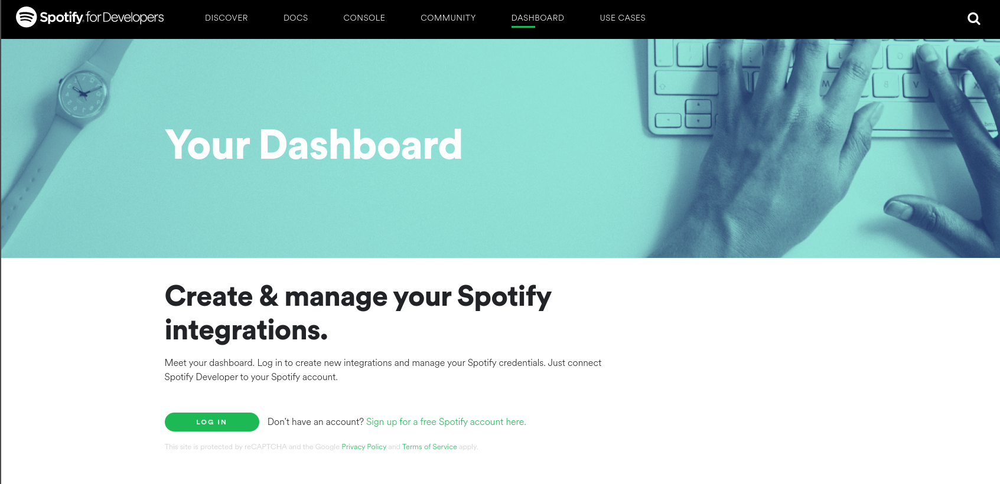
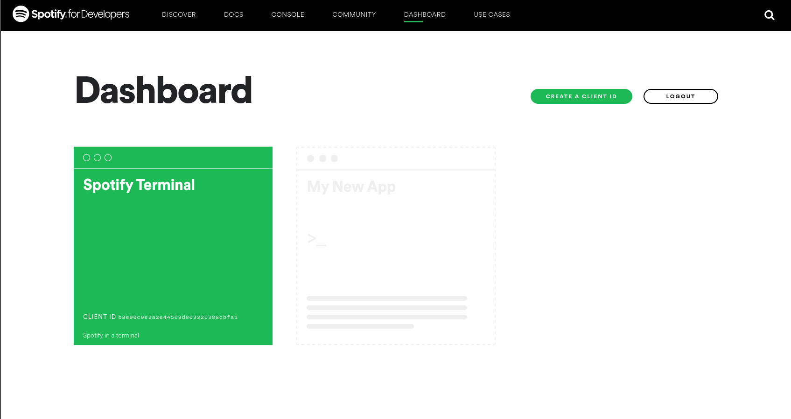
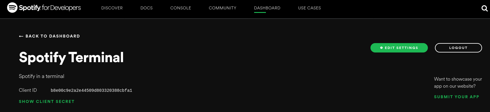

# SPOTIFIX

1. [Mon projet](#mon_Projet)
   1. [Description](#description)
   2. [Raison du developpement](#raison)
2. [Fonctionalité et Téchnologies Utilisées](#fonction)
   1. [Téchnologies Utilisées](#techno)
   2. [Fonctionalitées](#fonctionalite)
3. [Guide d'installation](#guide)
   1. [Elements requis](#element)
   2. [Installation des packages necessaire](#packages)
   3. [Installation de Spotifix](#spotifix)
4. [Fonctionnement et utilisation](#fonctionnement)
   1. [Search for an artist](#artist)
   2. [Search for a playlist](#playlist)
   3. [Play one of my playlist](#one_playlist)
   4. [Setting playlist](#setting)
5. [Bug à corriger](#bug_a_corriger)
6. [Annexes](#annexe)


## 1 Mon Projet <a name="mon_projet"></a>
### 1 Description <a name="description"></a>
    
Spotifix est un logiciel permetant d'utiliser Spotify en CLI. À la difference de `spotify-cli` l'interface cli et bien plus petite avec seulement les informations neccesaires à l'instant T. Et contrairement à `tizonia` il embarque plus de fonctionalitées et est plus légé.

Spotifix utilise l'api de spotify, ce qui permet d'avoir les mêmes fonctionalitées que le client lourd(enfin pas pour le moment mais c'est le but). Il est bien plus légé que le client lourd et n'a pas besoin d'interface graphique.

### 2 Raison du developpement <a name="raison"></a>

Spotifix à été developper pour lors d'un projet d'étude. Le but premier était de déveloper un mixte de  `tizonia` et de `spotify-cli` en prennant exemple de l'interface CLI épuré de `tizonia` couplé aux fonctionalitées de `spotify-cli`.

Developpé en python il permet de s'intaller facilement sur n'importe quel architecture `RISC`.

## 2 Fonctionalité et Téchnologies Utilisées <a name="fonction"></a>
### 1 Téchnologies Utilisées <a name="techno"></a>
**Langage:**
* Python3
  
**SDK:**
* spotipy

**Lib:**
* datetime
* time
* threading
* sys
* os
* json


### 2 Fonctionalitées <a name="fonctionalite"></a>
* Rechercher un artist et jouer un de ses son.
* Rechercher une playlist et et la jouer
* Voir mes playlist et les jouers.
* Lecteur avec une bar de progression en temps réel
* Modifier mes playlists

**Fonctionalitées du lecteur:**
* Lecture / Pause
* Volume + / -
* Suivre la playlist
* Ajouter un son à une playlist
* Lecture aléatoire
* Chanson suivante
* Chanson précedente

**Fonctionalitées de modifacation de playlist:**
* Changer le nom
* Changer la description
* Changer l'état de la playlist (Public/Privé)
* Surprimmer un son de la playlist
* Ajouter un son d'une playlist à une autre
* Créer une playlist
* Se désabonner d'une playlist


## 3 Guide d'installation <a name="guide"></a>
***Instalation faite sous Arch-Linux***
### 1 Elements requis <a name="element"></a>

Pour instaler et utiliser Spotifix vous devez avoir:
1. Un compte Spotify premium 
2. Le client Lourd de spotify ou un moteur de recherche avec spotify de lancé dessus (en étant connecté).
3. Python3
4. Git

### 2 Installation des packages necessaire <a name="packages"></a>
1. Installation de python3

```
sudo pacman -Syyuu
sudo pacman -S python3
```
2. Installation des différents packages neccesaires:

```
sudo pip3 install threaded spotipy jsondiff jsonschema datetime spotify
```
### 3 Installation de Spotifix <a name="spotifix"></a>

1. Installtion de git
```
sudo pacman -S git
```
2. git clone sur mon projet
```
git clone https://github.com/FlorianLeveil/UF_DEV_LOGICIEL
```
3. Recolter sa clé privé et public spotify.
   1. Aller sur se lien: https://developer.spotify.com/dashboard/
   
   1. Connectez vous
   2. Créez un nouveau projet
   
   3. Cliquez sur votre nouveau projet
   4. Copier coller votre client-id dans le `main.py` à la ligne 17
   
   5. Appuyer sur `Show client secret` et copier coller votre client secret dans le `main.py` à la ligne 16.

4. Spotifix est installer. Pour l'éxcuter faite comme ceci:
```
python3 ./main.py <user_name>
```

## 4 Fonctionnement et utilisation <a name="fonctionnement"></a>
### 1 Search for an artist <a name="artist"></a>
### 2 Search for a playlist <a name="playlist"></a>
### 3 Play one of my playlist <a name="one_playlist"></a>
### 4 Setting playlist <a name="setting"></a>

## 5 Bug à corriger <a name="bug_a_corriger"></a>

## 6 Annexes <a name="annexe"></a>