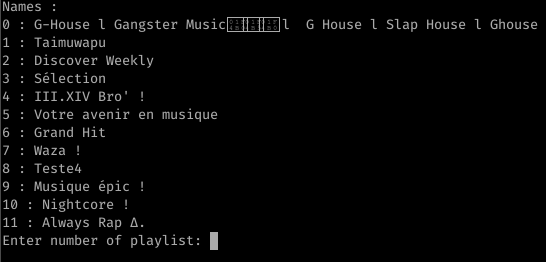
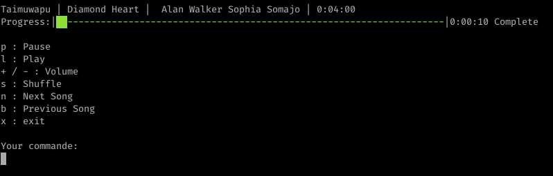
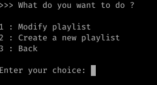

# SPOTIFIX

1. [Mon projet](#mon_Projet)
   1. [Description](#description)
   2. [Raison du developpement](#raison)
2. [Fonctionalité et Téchnologies Utilisées](#fonction)
   1. [Téchnologies Utilisées](#techno)
   2. [Fonctionalités](#fonctionalite)
3. [Guide d'installation](#guide)
   1. [Elements requis](#element)
   2. [Installation des packages necessaire](#packages)
   3. [Installation de Spotifix](#spotifix)
4. [Fonctionnement et utilisation](#fonctionnement)
   1. [Menu](#menu)
   2. [Search for an artist](#artist)
   3. [Search for a playlist](#playlist)
   4. [Play one of my playlist](#one_playlist)
   5. [Setting playlist](#setting)
5. [Bug à corriger](#bug_a_corriger)
6. [Annexes](#annexe)


## 1 Mon Projet <a name="mon_projet"></a>
### 1 Description <a name="description"></a>
    
Spotifix est un logiciel permetant d'utiliser Spotify en CLI. À la différence de `spotify-cli` l'interface cli est bien plus petite avec seulement les informations nécessaires à l'instant T. Et contrairement à `tizonia` il embarque plus de fonctionalités et est plus léger.

Spotifix utilise l'api de spotify, ce qui permet d'avoir les mêmes fonctionalités que le client lourd (enfin pas pour le moment mais c'est le but). Il est bien plus léger que le client lourd et n'a pas besoin d'interface graphique.

### 2 Raison du développement <a name="raison"></a>

Spotifix à été developpé lors d'un projet d'étude. Le but premier était de développer un mixte de  `tizonia` et de `spotify-cli` en prenant exemple de l'interface CLI épurée de `tizonia` couplée aux fonctionalités de `spotify-cli`.

Developpé en python il permet de s'intaller facilement sur n'importe quelle architecture `RISC`.

## 2 Fonctionalités et Technologies Utilisées <a name="fonction"></a>
### I Téchnologies Utilisées <a name="techno"></a>
**Langage:**
* Python3
  
**SDK:**
* spotipy

**Lib:**
* datetime
* time
* threading
* sys
* os
* json


### II fonctionalités <a name="fonctionalite"></a>
* Rechercher un artist et jouer un de ses sons.
* Rechercher une playlist et la jouer
* Voir mes playlist et les jouer.
* Lecteur avec une barre de progression en temps réel
* Modifier mes playlists

**Fonctionalités du lecteur:**
* Lecture / Pause
* Volume + / -
* Suivre la playlist
* Ajouter un son à une playlist
* Lecture aléatoire
* Chanson suivante
* Chanson précédente

**Fonctionalités de modification de playlist:**
* Changer le nom
* Changer la description
* Changer l'état de la playlist (Public/Privé)
* Surprimmer un son de la playlist
* Ajouter un son d'une playlist à une autre
* Créer une playlist
* Se désabonner d'une playlist


## 3 Guide d'installation <a name="guide"></a>
***Instalation faite sous Arch-Linux***
### I Eléments requis <a name="element"></a>

Pour installer et utiliser Spotifix vous devez avoir:
1. Un compte Spotify premium 
2. Le client Lourd de spotify ou un moteur de recherche avec spotify de lancé dessus (en étant connecté).
3. Python3
4. Git

### II Installation des packages necessaire <a name="packages"></a>
1. Installation de python3

```
sudo pacman -Syyuu
sudo pacman -S python3
```
2. Installation des différents packages nécessaires:

```
sudo pip3 install threaded spotipy jsondiff jsonschema datetime spotify
```
### III Installation de Spotifix <a name="spotifix"></a>

1. Installtion de git
```
sudo pacman -S git
```
2. git clone sur mon projet
```
git clone https://github.com/FlorianLeveil/UF_DEV_LOGICIEL
```
3. Recolter sa clé privé et public spotify.
   1. Aller sur ce lien: https://developer.spotify.com/dashboard/
   
   1. Se connecter
   2. Créer un nouveau projet
   
   3. Cliquer sur votre nouveau projet
   4. Copier coller votre client-id dans le `main.py` à la ligne 17
   
   5. Appuyer sur `Show client secret` et copier coller votre client secret dans le `main.py` à la ligne 16.

4. Spotifix est installé. Pour l'éxcuter faire comme ceci:
```
python3 ./main.py <user_name>
```

## 4 Fonctionnement et utilisation <a name="fonctionnement"></a>
### I Menu <a name="menu"></a>


***
### II Search for an artist <a name="artist"></a>
**Mettre le nom de l'ariste que vous voulez**


**Entrer le numero du son que vous voulez jouer**


#### Lecteur:


**Les commandes:**
* p : Met votre son en pause
* l : Met votre son en lecture
* / - / + : Monter et descendre le volume de spotify
* x : quitter et revenir au menu précedent
* r : Ajoute le son a la playlist de votre choix

**Pour ajouter le son a une de vos playlist entrer `r` puis entrer le numero de votre playlist**


***
### III Search for a playlist <a name="playlist"></a>

**Taper le nom de la playlist ou le genre que vous voulez et entrer le numéro de la playlist**


#### Lecteur:


**Les commandes:**
* p : Met votre son en pause
* l : Met votre son en lecture
* s : Lit vos sons de façon aléatoire
* n : Son suivant
* b : Son précedent
* / - / + : Monter et descendre le volume de spotify
* x : quitter et revenir au menu précedent
* a : Suivre la playlist

***
### IV Play one of my playlist <a name="one_playlist"></a>

**Taper le numéro de la playlist que vous voulez jouer**



#### Lecteur:



**Les commandes:**
* p : Met votre son en pause
* l : Met votre son en lecture
* s : Lit vos sons de façon aléatoire
* n : Son suivant
* b : Son précedent
* / - / + : Monter et descendre le volume de spotify
* x : quitter et revenir au menu précedent

***
### V Setting playlist <a name="setting"></a>

**Choisir entre modifier une playlist ou en créer une**



**Choix 1: Modifier une playlist**

**entrer le numéro de votre playlist**


**Si vous êtes le proprietaire de la playlist vous tomberez sur ce menu**


**Les commandes:**
* 1 : Supprimer un son de votre playlist
* 2 : Changer le nom de votre playlist
* 3 : Mettre votre playlist en public ou privé
* 4 : Changer la description de votre playlist
* 5 : Quitter

**Supprimer le son de votre playlist**

Entrer le numéro du son que vous voulez supprimer


**Changer le nom de votre playlist**

entrer votre nouveau nom


**Mettre votre playlist en public ou privé**

entrer `public` ou `private`


**Changer la description de votre playlist**

Entrer la nouvelle descritpion de votre playlist


**Si vous n'êtes pas le proprietaire de la playlist vous tomberez sur ce menu**


**Les commandes:**
* 1 : Se désabonner de la playlist
* 2 : Ajouter un des sons de cette playlist à une autre

**Ajouter un des sons de cette playlist à une autre**

entrer le numéro du son concerné


Entrer le numéro de la playlist concernée


**Choix 2: Créer une playlist**

entrer le nom de votre playlist


entrer la description de votre playlist


Choisir entre public ou privé!


Confirmer la création de votre playlist


***
## 5 Bug à corriger <a name="bug_a_corriger"></a>

1. Vous ne pouvez pas quitter le lecteur si le son ou la playlist est en pause
2. Vous ne pouvez pas activer la fonction shuffle sur une playlist puis revenir sur la recherche d'artist pour lire un son
3. La fonction resume ne marche plus des lors que vous rentrez dans le menu de modification de playlist
4. Gérer la casse sur les fonctions suivante:
   * Resume
   * Chercher un artiste
   * Chercher une playlist
   * Jouer une de mes playlist


## 6 Annexes <a name="annexe"></a>

* Doc SDK Spotipy: https://spotipy.readthedocs.io/en/2.12.0/
* Doc API Spotify: https://developer.spotify.com/console/
* Ma présentation en PDF : [Ma présentation](./presentation.pdf)